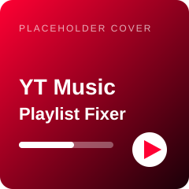
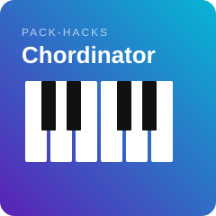
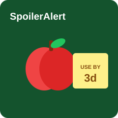
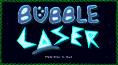

  

 

  
  

---

##  Pinned Project

<table>
  <tr>
    <td width="120">
      
    </td>
    <td>
      <b>Youtube-Music-Playlist-Fixer</b> 
      TypeScript · Chrome extension  
      This chrome extension fixes greyed out and unplayable songs in your youtube music playlist by finding re-uploads or alternate uploads.  
      <a href="https://github.com/Austinwu-rgb/Youtube-Music-Playlist-Fixer">open project →</a>
    </td>
  </tr>
</table>

---

##  Featured Projects

<table>
  <thead>
    <tr>
      <th></th>
      <th>#</th>
      <th align="left">title</th>
      <th align="left">album notes</th>
      <th>runtime</th>
    </tr>
  </thead>
  <tbody>
    <tr>
      <td>
        
      </td>
      <td align="center"><b>01</b></td>
      <td>
        <a href="https://github.com/Austinwu-rgb/Youtube-Music-Playlist-Fixer"><b>Youtube-Music-Playlist-Fixer</b></a> 
        Austin Wu · TypeScript
      </td>
      <td>Chrome ext that finds unplayable YT Music tracks and swaps them</td>
      <td align="center"><code>TS</code></td>
    </tr>
    <tr>
      <td>
        
      </td>
      <td align="center"><b>02</b></td>
      <td>
        <a href="https://github.com/PACK-Hacks/Chordinator.AI"><b>Chordinator.AI</b></a> 
        PACK-Hacks · Python + JS
      </td>
      <td>Hackathon project for chord / music ideas</td>
      <td align="center"><code>PY</code></td>
    </tr>
    <tr>
      <td>
        
      </td>
      <td align="center"><b>03</b></td>
      <td>
        <a href="https://github.com/Austinwu-rgb/SpoilerAlert"><b>SpoilerAlert</b></a> 
        Austin Wu · React + Node
      </td>
      <td>Food expiry tracker so nothing dies in the fridge</td>
      <td align="center"><code>JS</code></td>
    </tr>
    <tr>
      <td>
        
      </td>
      <td align="center"><b>04</b></td>
      <td>
        <a href="https://github.com/Austinwu-rgb/Laser-Bubble"><b>Laser-Bubble</b></a> 
        Austin Wu · GameMaker
      </td>
      <td>Little bubble + laser arcade game</td>
      <td align="center"><code>GML</code></td>
    </tr>
  </tbody>
</table>

---

##  Tech stack

  
  
  
  
  
  
  
  
  
  
  
  
  
  
  
  

---

## notes

- Hey, I'm Austin, I like to make software that might make my life and other's a little easier! Always excited to learn more!
